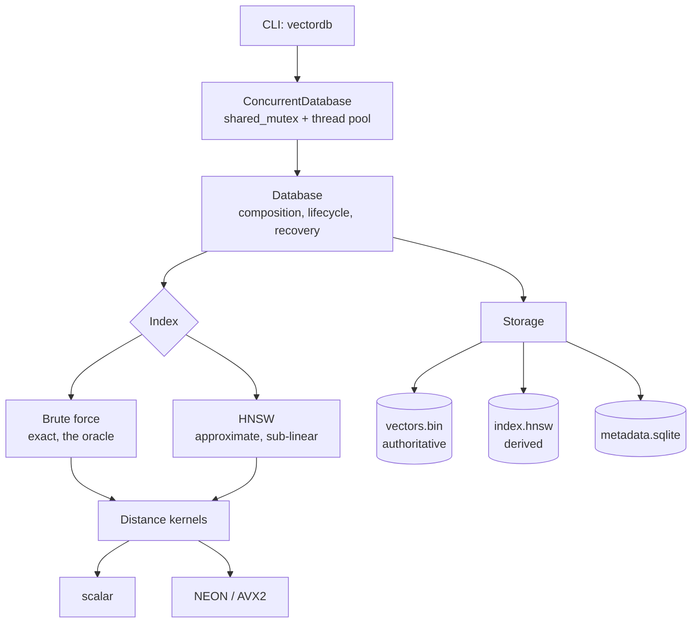

# VectorDB

A local-first vector database written from scratch in C++20.

Store high-dimensional `float32` vectors with metadata, then find the nearest
ones — exactly with a brute-force scan, or approximately in microseconds with a
hand-written HNSW graph index.

Think SQLite rather than Postgres: one process, files on disk, no server.

```sh
vectordb create papers.vdb --dimension 768 --metric cosine
vectordb import papers.vdb --input embeddings.vecs
vectordb search papers.vdb --query-file query.vecs --k 10 \
    --filter 'category == "finance" and year >= 2020'
```

---

## Why this exists

Wrapping FAISS or hnswlib gets you working vector search in an afternoon and
teaches you an API. This project implements the algorithms and the storage engine
itself, because the interesting parts are the ones a library hides: what happens
to 3 KB of floats between `insert` and `fsync`, why a graph you already know how
to traverse turns a 6-millisecond scan into 20 microseconds, and what survives a
`kill -9`.

It is also a **guided course** from strong-DSA-C++ to systems engineering — 62
learning notes, 10 exercises and 13 architecture decision records, written
alongside the code rather than after it. Start at
[`learnings/00-start-here.md`](learnings/00-start-here.md).

## Measured on an Apple M1

All figures from `vectordb-bench`, Release build. Full provenance and methodology
in [`docs/benchmark-results.md`](docs/benchmark-results.md).

| | |
|---|---|
| HNSW search, N=50k D=128 | **20 µs** at recall@10 = 0.959 — **32× faster** than exact |
| Recall at efSearch=20 | **0.988** (1.000 from efSearch=100) |
| Index overhead | **145 bytes/vector** at M=16, independent of dimension |
| NEON vs scalar kernel | **3.6–4.1×** |
| Brute-force scan | 38–48 GB/s — memory-bandwidth-bound |
| Concurrent batch search | **4.19×** on 8 cores |
| Reopen a persisted index | **9 ms** vs 7.8 s to rebuild — 860× |
| Build | 6,466 vectors/s at D=128 |

## Features

- **Two indexes behind one interface.** Brute force is exact and is the oracle
  every HNSW result is measured against; HNSW is approximate and sub-linear.
- **Three metrics** — squared L2, cosine, inner product — with an internal
  ordering convention that removes per-metric branching from every comparison.
- **SIMD** kernels for ARM NEON and x86 AVX2, selected by runtime CPU detection
  and validated against the scalar reference.
- **Durable, validated storage.** Versioned binary formats with CRCs, atomic
  replacement, and every neighbour reference checked before the graph is used.
- **Metadata and filtering** in SQLite, with a deliberately small filter
  language.
- **Concurrency**: many simultaneous readers, one writer, clean under
  ThreadSanitizer.
- **A CLI** that is a thin shell over the library, so everything it can do is
  also reachable from C++.

## Design principles

| | |
|---|---|
| **Correctness first** | Brute force was built before HNSW and still ships, so every approximate result has an exact answer to be measured against. |
| **Layered, one-directional** | The query engine does not know the CLI exists; HNSW does not know SQLite exists. Enforced by header placement and CMake visibility, not by convention. |
| **Honest numbers** | Every figure names the machine, compiler, build and parameters. What was not measured is [listed as not measured](docs/benchmark-results.md#not-measured). |
| **Explicit bytes** | No struct is ever dumped to disk. Every field is serialized individually, with magic, version and validation on load. |
| **Own the algorithms** | No FAISS, no hnswlib. External libraries are used for logging, JSON, SQLite and tests only. |

## Architecture



A database is a directory of three files, and the asymmetry between them is the
design: a corrupt index is a rebuild, a corrupt vector store is data loss.

Full write-up: [`docs/architecture.md`](docs/architecture.md).

## Building

Requires a C++20 compiler, CMake ≥ 3.24, Ninja and
[vcpkg](https://github.com/microsoft/vcpkg).

```sh
git clone https://github.com/microsoft/vcpkg.git ~/vcpkg
~/vcpkg/bootstrap-vcpkg.sh
export VCPKG_ROOT=~/vcpkg

cmake --preset release
cmake --build --preset release
ctest --preset release            # 327 tests
```

The first configure compiles the dependencies (spdlog, nlohmann/json, SQLite,
GoogleTest) and takes a few minutes. Subsequent builds are seconds.

| Preset | For |
|---|---|
| `debug` | development — assertions, `-Werror` |
| `release` | **the only build whose timings mean anything** |
| `relwithdebinfo` | profiling |
| `asan` / `tsan` | AddressSanitizer / ThreadSanitizer |

Tested on macOS (arm64) and Linux (x86-64). Windows is not tested and is not
claimed.

## Quick start

```sh
./examples/01-quickstart.sh          # the whole loop in 4 dimensions
```

Or by hand:

```sh
vectordb create demo.vdb --dimension 4 --metric cosine
vectordb insert demo.vdb --vector "1,0,0,0" --meta name=north --meta year=2026
vectordb insert demo.vdb --vector "0,1,0,0" --meta name=east  --meta year=2020
vectordb search demo.vdb --query "1,0,0,0" --k 2 --time
vectordb search demo.vdb --query "1,0,0,0" --filter 'year >= 2026'
vectordb stats demo.vdb
vectordb check demo.vdb --deep
```

Seven runnable examples in [`examples/`](examples/README.md), each generating its
own data.

## Documentation

| | |
|---|---|
| [`learnings/`](learnings/00-start-here.md) | the guided course — start here to *understand* it |
| [`docs/architecture.md`](docs/architecture.md) | how the pieces fit |
| [`docs/hnsw.md`](docs/hnsw.md) | the index, from structure to measured recall |
| [`docs/decisions/`](docs/decisions/README.md) | 13 ADRs — what we chose and what it costs |
| [`docs/benchmark-results.md`](docs/benchmark-results.md) | measured numbers, with provenance |
| [`docs/final-report.md`](docs/final-report.md) | the engineering report |
| [`docs/development.md`](docs/development.md) | setup and the everyday loop |

## Limitations

Stated rather than left to be discovered:

- **No concurrent writers.** Many readers, one writer. Making HNSW insertion
  thread-safe needs per-node locking and a reclamation scheme.
- **Durability is at `flush`, not per insert.** A crash loses un-flushed inserts
  and never produces inconsistent state. There is no write-ahead log.
- **The AVX2 kernel has never run on x86-64 hardware** here. It is guarded by
  runtime detection and validated by the same test suite as every other kernel,
  but no AVX2 performance numbers are reported.
- **Memory mapping saves a copy, not the resident footprint.** Searching directly
  over a live mapping is not implemented.
- **Filtered approximate search over-fetches and post-filters**, which degrades
  with selectivity. `--exact` is the escape hatch.
- **`float32` only, one fixed dimension per database.** No quantization.
- **No distributed mode, network API or authentication**, by design.

Where each would plug in: [`learnings/next-steps.md`](learnings/next-steps.md).

## License

MIT — see [LICENSE](LICENSE).
