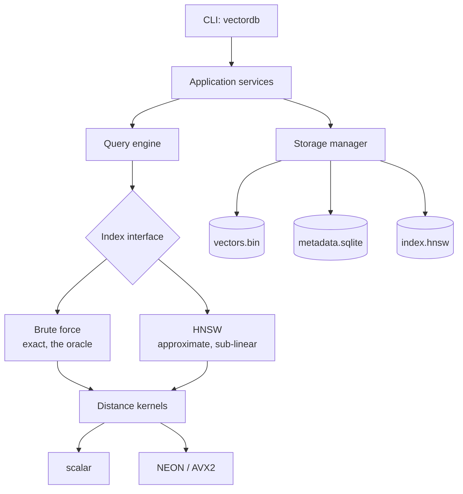

# VectorDB

A local-first vector database written from scratch in C++20.

Store high-dimensional `float32` vectors with metadata, then find the nearest
ones — exactly with a brute-force scan, or approximately in sub-linear time with
a hand-written HNSW graph index.

Think SQLite rather than Postgres: one process, files on disk, no server.

> **Status:** under active development. [`learnings/progress.md`](learnings/progress.md)
> is the authoritative list of what is actually implemented — this README does
> not describe anything that does not work.

---

## Why this exists

Wrapping FAISS or hnswlib gets you a working vector search in an afternoon and
teaches you an API. This project implements the algorithms and the storage
engine itself, because the interesting parts are the ones a library hides:

- what happens to 3 KB of floats between `insert` and `fsync`
- why an `O(N·D)` scan of 5M×768 floats is 3.8 billion multiply-adds per query
- how a graph you can already traverse turns that into microseconds
- what survives `kill -9`, and what has to be rebuilt afterwards

The repository doubles as a guided course from strong-DSA-C++ to systems
engineering — see [`learnings/00-start-here.md`](learnings/00-start-here.md).

## Design principles

| | |
|---|---|
| **Correctness first** | Brute force is implemented before HNSW and stays as the oracle every approximate result is measured against. |
| **Layered, one-directional** | The query engine does not know the CLI exists. HNSW does not know SQLite exists. Enforced by CMake target visibility, not by convention. |
| **Honest numbers** | Every figure in [`docs/benchmark-results.md`](docs/benchmark-results.md) names the machine, compiler, build type and parameters that produced it. Nothing is estimated. |
| **Explicit bytes** | No struct is ever dumped to disk. Every persisted field is serialized individually, with magic, version and validation on load. |
| **Own the algorithms** | No FAISS, no hnswlib. External libraries are used for logging, JSON, SQLite and tests only. |

## Architecture



Full write-up: [`docs/architecture.md`](docs/architecture.md).

## Building

Requires a C++20 compiler, CMake ≥ 3.24, Ninja, and
[vcpkg](https://github.com/microsoft/vcpkg).

```sh
git clone https://github.com/microsoft/vcpkg.git ~/vcpkg
~/vcpkg/bootstrap-vcpkg.sh
export VCPKG_ROOT=~/vcpkg

cmake --preset release
cmake --build --preset release
ctest --preset release
```

The first configure compiles the dependencies (spdlog, nlohmann/json, SQLite,
GoogleTest) and takes a few minutes. Subsequent builds are seconds.

### Build presets

| Preset | For |
|---|---|
| `debug` | development — assertions on, `-Werror` |
| `release` | **the only build whose timings mean anything** |
| `relwithdebinfo` | profiling — optimised, with symbols |
| `asan` | AddressSanitizer + UBSan |
| `tsan` | ThreadSanitizer |

Tested on macOS (arm64) and Linux (x86-64). Windows is not tested and is not
claimed to work.

## Quick start

```sh
./build/release/bin/vectordb version
./build/release/bin/vectordb help
```

Further commands land as the phases complete; see
[`learnings/progress.md`](learnings/progress.md).

## Repository layout

```
include/vectordb/   public headers — the API surface
src/                implementation
  core/             ids, errors, vector representation
  distance/         metrics and SIMD kernels
  index/            brute force and HNSW
  storage/          vector file and SQLite metadata
  persistence/      serialization primitives
  concurrency/      thread pool
  db/               database composition
  cli/              thin command-line shell
tests/              unit, integration, performance
benchmarks/         the benchmark driver
docs/               architecture, formats, ADRs, measured results
learnings/          the guided course
```

## Documentation

| | |
|---|---|
| [`learnings/`](learnings/00-start-here.md) | the guided course — start here if you want to *understand* it |
| [`docs/architecture.md`](docs/architecture.md) | how the pieces fit |
| [`docs/decisions/`](docs/decisions/) | architecture decision records — what we chose and what it costs |
| [`docs/benchmark-results.md`](docs/benchmark-results.md) | measured numbers with full provenance |

## Limitations

Deliberate, and not planned for v1: no distributed mode, no network API, no
authentication, no GPU support, no quantization. Vectors are `float32` only, and
a database has one fixed dimension. See
[`learnings/next-steps.md`](learnings/next-steps.md) for where each of those
would plug in.

## License

MIT — see [LICENSE](LICENSE).
