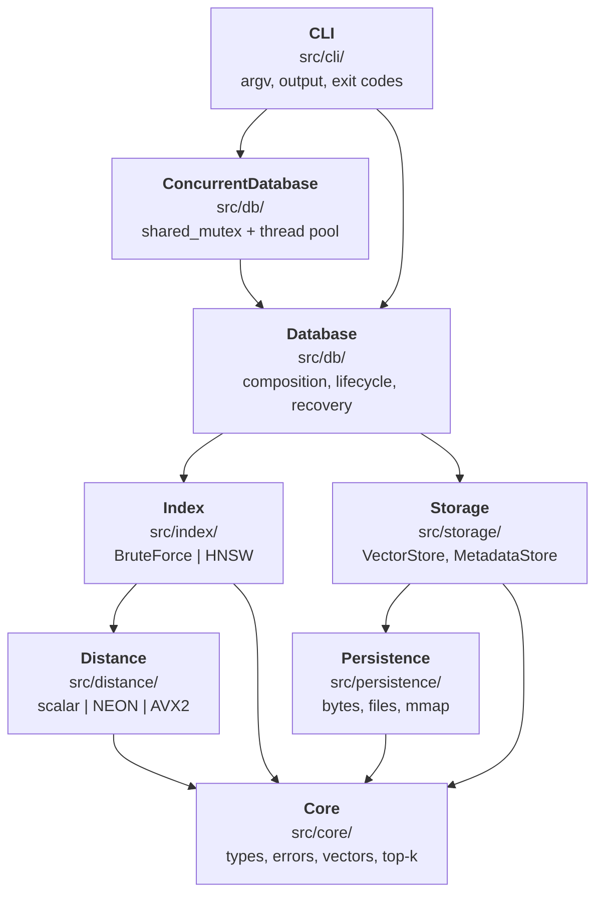
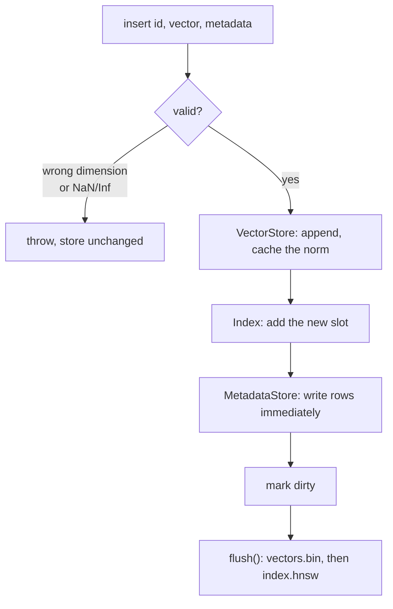
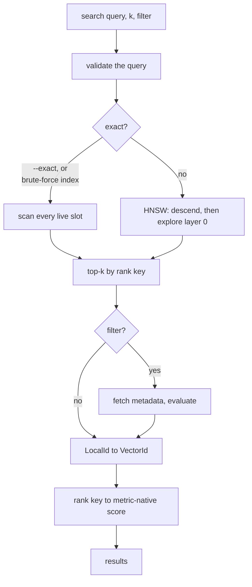
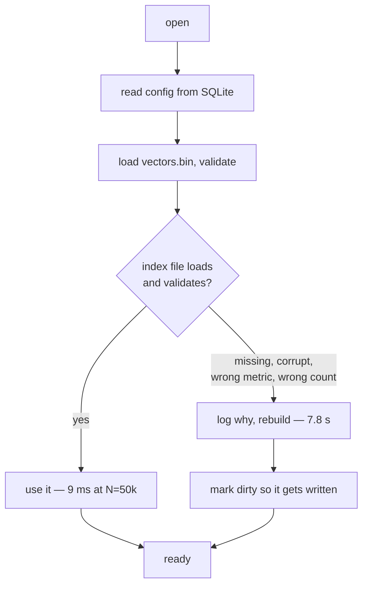

# Architecture

How the pieces fit, and the one rule that keeps them apart.

## The rule

> **Dependencies point downward only.**

The query engine does not know the CLI exists. HNSW does not know SQLite exists.
The distance kernels do not know what a database is.

This is not a convention. It is enforced by where headers live and by CMake
target visibility — SQLite's wrapper header is under `src/storage/` and the
library links `sqlite3` `PRIVATE`, so an `#include <sqlite3.h>` anywhere above
the metadata store is a compile error, not a review comment.

## Layers



| Layer | Knows about | Deliberately does not know about |
|---|---|---|
| `core/` | nothing | everything else |
| `distance/` | core | indexes, storage, the database |
| `persistence/` | core | what the bytes mean |
| `storage/` | core, persistence | indexes, search |
| `index/` | core, distance, a read-only view of storage | SQLite, files, the CLI |
| `db/` | all of the above | the CLI |
| `cli/` | db | anything below it |

## The three artefacts

A database is a directory:

```
mydb/
├── vectors.bin       authoritative. Everything else derives from this.
├── index.hnsw        derived, disposable, rebuildable
└── metadata.sqlite   metadata rows + the database configuration
```

**The asymmetry is the design.** A corrupt index is a rebuild; a corrupt vector
store is data loss. That single fact decides the recovery story, the flush
ordering, and what `check` treats as an error versus a warning.

## The write path



Three things worth noticing.

**Validation happens before any mutation**, so a rejected insert leaves the
store byte-identical. A caller that catches and retries must not be operating on
a half-accepted state.

**The store is written before the index is told.** The index only ever receives
a slot number, because the vector is already reachable through the accessor.
That ordering is what makes an index rebuildable by replaying `add` over every
live slot.

**Vectors and the index are written on `flush`, metadata immediately.** SQLite
is transactional and cheap per row; rewriting a 3 GB vector file per insert is
not. The guarantee is therefore: a crash before `flush` loses the un-flushed
inserts and never produces inconsistent state.

## The read path



The conversions at the end — slot to id, rank key to score — happen **k times
per query, not N times**. That is a recurring principle: pick the representation
your algorithm wants, and convert at the boundary.

## The two id spaces

| | Type | Stable? | Used by |
|---|---|---|---|
| `VectorId` | `uint64` | forever | users, metadata, results |
| `LocalId` | `uint32` | until compaction | storage offsets, graph edges |

Two ids look like complexity until you count edges. At 1M vectors with M=16,
HNSW stores ~32M neighbour references: 128 MB at 32 bits, 256 MB at 64. A dense
`LocalId` also makes vector lookup a multiply-add rather than a hash probe, in
the innermost loop of the system.

And it is what lets compaction renumber slots without invalidating a single user
reference. [ADR-0003](decisions/ADR-0003-id-model.md).

## Recovery



A bad index is never a reason to fail an open. It is a reason to spend CPU. But
the fallback is *logged*, not silent — a database that quietly rebuilds on every
open would be a mystery rather than a feature.

## Where each concern lives

| Concern | Files |
|---|---|
| Vocabulary, errors, top-k | `src/core/`, `include/vectordb/core/` |
| Metrics and SIMD | `src/distance/` |
| Exact search | `src/index/brute_force/` |
| Approximate search | `src/index/hnsw/` |
| Bytes, files, mmap | `src/persistence/` |
| Vector and metadata storage | `src/storage/` |
| Composition and lifecycle | `src/db/` |
| Threads | `src/concurrency/` |
| Datasets and interchange | `src/util/` |
| Command line | `src/cli/` |

## Design principles, and where each was applied

**Correctness before speed.** Brute force was implemented first and kept, so
every approximate result has an oracle to be measured against
([ADR-0006](decisions/ADR-0006-brute-force-first.md)).

**Layout follows access pattern.** Contiguous vectors because the scan is
sequential ([ADR-0004](decisions/ADR-0004-contiguous-storage.md)); struct-of-
arrays because the distance loop reads floats and nothing else; a flat layer-0
link array because that is where the traffic is; an arena for the sparse upper
layers.

**Validate at the boundary, assume inside.** NaN is rejected at insert so the
inner loop can assume a total order ([ADR-0007](decisions/ADR-0007-nan-policy.md)).
Graph references are validated at load so the search loop never bounds-checks
([ADR-0008](decisions/ADR-0008-validate-on-load.md)).

**Pay per-item costs on k, not N.** Score conversion, id translation and metadata
lookup all happen after the top-k.

**Say what is not supported.** Concurrent writers, AVX2 measurements,
million-vector benchmarks — each is absent and each is listed as absent.

## Reading order

1. `include/vectordb/core/types.hpp` — the vocabulary
2. `src/distance/` — pure functions, no state
3. `src/index/brute_force/` — the whole search idea, none of the tricks
4. `src/storage/` — where the floats live
5. `src/index/hnsw/` — the hard part
6. `src/db/database.cpp` — composition
7. `src/cli/` — a thin shell; read last

Or `git log --oneline --reverse`, which is the same order with the reasoning
attached.
