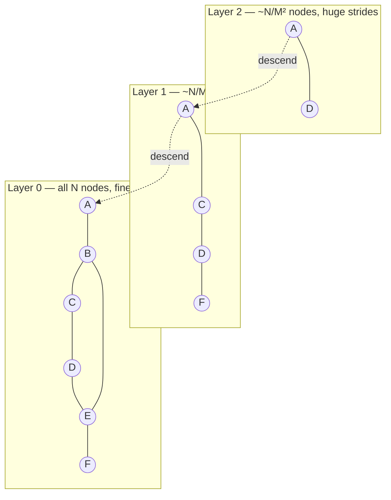
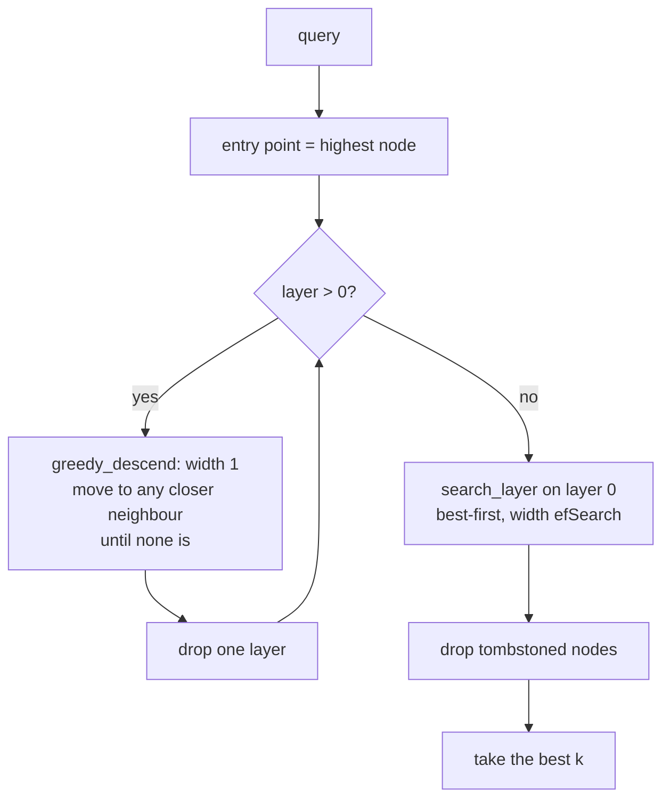
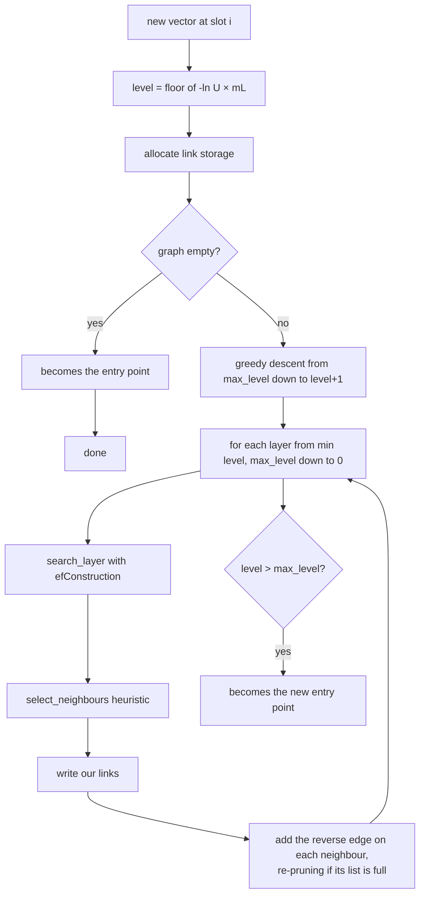

# HNSW

Hierarchical Navigable Small World graph index. Implemented from scratch in
`src/index/hnsw/`.

Learning path: [intuition](../learnings/40-search-indexes/03-hnsw-intuition.md) →
[algorithm](../learnings/40-search-indexes/04-hnsw-algorithm.md) →
[implementation](../learnings/40-search-indexes/05-hnsw-implementation.md).

## Structure

A stack of proximity graphs. Layer 0 contains every node; each layer above holds
roughly `1/M` of the layer below. A node present at layer `L` also appears in
every layer beneath it.



Because the upper layers are sparse, their nodes are far apart, so their edges
span long distances. **The long-range links are not designed; they are a
consequence of sparseness.**

## Parameters

| Name | Default | Effect | Changing it |
|---|---|---|---|
| `M` | 16 | neighbours per node above layer 0 | requires a rebuild |
| `max_m0` | `2M` = 32 | neighbours on layer 0 | derived |
| `efConstruction` | 200 | candidate width while inserting | requires a rebuild |
| `efSearch` | 64 | candidate width while searching | **runtime, per query** |
| `seed` | 42 | level assignment | requires a rebuild |

`mL = 1 / ln(M)` is the level-generation constant. It makes each layer hold
about `1/M` of the one below, so the tower is `~log_M(N)` deep and the descent
through it is logarithmic. That constant is what makes HNSW sub-linear.

Layer 0 gets `2M` because it holds every node and takes essentially all of the
search traffic; a denser graph there is worth the memory. This is the original
paper's recommendation and it is a measurable effect.

## Search



### Phase 1 — descend

From the entry point down to layer 1, a width-1 greedy walk. These layers exist
only to reach the right neighbourhood cheaply; a wide search here would buy
precision that phase 2 immediately discards.

### Phase 2 — explore

A best-first search of layer 0 with two heaps:

- **frontier** — a min-heap by distance: which node to expand next
- **best** — a max-heap of the closest `ef` found so far: its root is the
  *worst* result held, which is the one a new candidate must beat

```
while frontier is not empty:
    c = closest unexpanded node
    if |best| == ef and c is worse than the worst of best:
        break                      # nothing reachable through c can help
    for each unvisited neighbour e of c:
        d = distance(query, e)
        if |best| < ef or d < worst(best):
            push e onto frontier and onto best
            if |best| > ef: drop the worst
```

The early exit is what separates this from a breadth-first search: once the
nearest thing left to explore is worse than the worst result already held,
nothing reachable through it can improve the answer. Greedy search depends on
the graph's small-world property for that to be true often enough — which is a
heuristic, and is exactly where the approximation lives.

`ef` is raised to `k` automatically if a caller asks for more results than the
candidate width, since otherwise the answer would be silently truncated.

## Insertion



Inserting costs about as much as searching, so building an index of N vectors is
roughly N searches — `O(N log N)` overall.

The reverse edge is not optional. Without it the new node points outward but
nothing points back, so nothing can reach it, and recall for recently-inserted
vectors collapses without any error.

## Neighbour selection

The candidate list from `search_layer` may hold `efConstruction` entries; only
`M` (or `2M` on layer 0) can be kept.

**Not the closest M.** In increasing distance order, accept candidate `e` only
if:

```
for every already-chosen r:   distance(e, r) >= distance(e, target)
```

If some chosen `r` is closer to `e` than the target is, `e` is reachable
*through* `r` and the edge is redundant.

The effect is a neighbourhood that fans out in different directions rather than
clustering on one side. A node at the edge of a dense cluster whose 16 nearest
neighbours are all inside that cluster becomes a dead end — a search can enter
but has no edge pointing anywhere else. Greedy search only works if some edge
points roughly toward the query, whatever direction that is.

If the heuristic is strict enough to leave the list short, it is filled from the
rejects in distance order: an under-filled list wastes memory already paid for,
and a sparser graph is a slower one.

The same routine runs when an existing node's list is full and a reverse edge
arrives. Simply dropping the new edge would let early insertions monopolise a
node's budget; simply evicting the furthest would discard the diversity the
heuristic is protecting.

## Memory layout

```
layer0_links_  [cnt][n0][n1]...[n31] [cnt][n0]...     stride = 2M + 1
               |<------ one node ------>|

upper_links_   append-only arena, stride M + 1 per (node, layer)
upper_offsets_ [off0][off1][kNone][off3]...           one per node
node_level_    [0][2][0][1]...                        one byte per node
```

Layer 0 is a flat array with a fixed stride because it holds every node and
takes nearly all the traffic. The neighbour count lives in slot 0, sharing a
cache line with the first neighbours it describes.

Upper layers hold about `1/M` of the nodes each, so a fixed stride across all
nodes would be almost entirely empty. They share one append-only arena instead.

`LocalId` is 32-bit specifically so these arrays are half the size they would
otherwise be — see [ADR-0003](decisions/ADR-0003-id-model.md).

### Footprint

```
bytes ≈ N × (2M + 1) × 4          layer 0
      + N/(M-1) × (M + 1) × 4 × ~1.2   upper layers (approx)
      + N × 4                     offsets
      + N                         levels
```

At N = 1,000,000 and M = 16 that is roughly **145 MB**, against 3 GB of
768-dimensional vectors. Measured at N = 5,000, M = 16, D = 64: 231 bytes per
vector.

## Deletion

Tombstones. The node stays in the graph and keeps routing traffic; `search`
filters it out of the results.

Physically removing a node would mean finding and repairing every neighbour list
that points at it, and — worse — the node may be the only bridge between two
regions. Cutting it can disconnect the graph silently, with recall collapsing
for whatever ends up on the wrong side.

Cost: deleted vectors still occupy memory and are still visited during
traversal. `vectordb rebuild-index` reclaims them. See
[ADR-0011](decisions/ADR-0011-tombstones.md).

A test deletes half the vectors from a 3,000-vector index and confirms recall
stays above 0.85 — the evidence that a tombstoned node still earns its keep as a
router.

## Determinism

Level assignment uses a seeded PRNG, and insertion order is fixed by the store's
slot order, so a build is reproducible. Two indexes built from the same data,
config and seed have byte-identical graphs, and there is a test asserting it.

This matters because it is what lets a recall regression be told apart from
ordinary randomness.

## Known limitations

- **Inner product is not a metric.** A vector is not its own nearest neighbour
  under `dot`, so the graph's assumptions are weaker and recall is measurably
  lower. Tested and asserted at a lower threshold rather than quietly excluded.
- **Insertion is not thread-safe.** Concurrent searches are; concurrent writes
  require exclusive access. See [concurrency.md](concurrency.md).
- **Slots must arrive in ascending order.** The index sizes its arrays on that
  assumption rather than carrying a map.
- **Search scratch is `thread_local`** and persists for the life of the thread.
- **Deletion does not reclaim memory** until a rebuild.

## Measured behaviour

5,000 clustered vectors, D = 64, M = 16, efConstruction = 200, L2, scalar
kernel, Release, Apple M1:

| efSearch | recall@10 |
|---|---|
| 10 | 0.999 |
| 20 | 1.000 |
| 50 | 1.000 |
| 100 | 1.000 |

At this scale HNSW is effectively exact, which is itself worth knowing: recall
is a weak signal for small collections, and the interesting recall/latency
trade only appears at larger N and higher D. Full measurements with timings are
in [benchmark-results.md](benchmark-results.md).

## References

Malkov & Yashunin, *Efficient and robust approximate nearest neighbor search
using Hierarchical Navigable Small World graphs* (2016), arXiv:1603.09320.
This implementation follows the paper's algorithms 1–5 with the neighbour
heuristic of algorithm 4.
