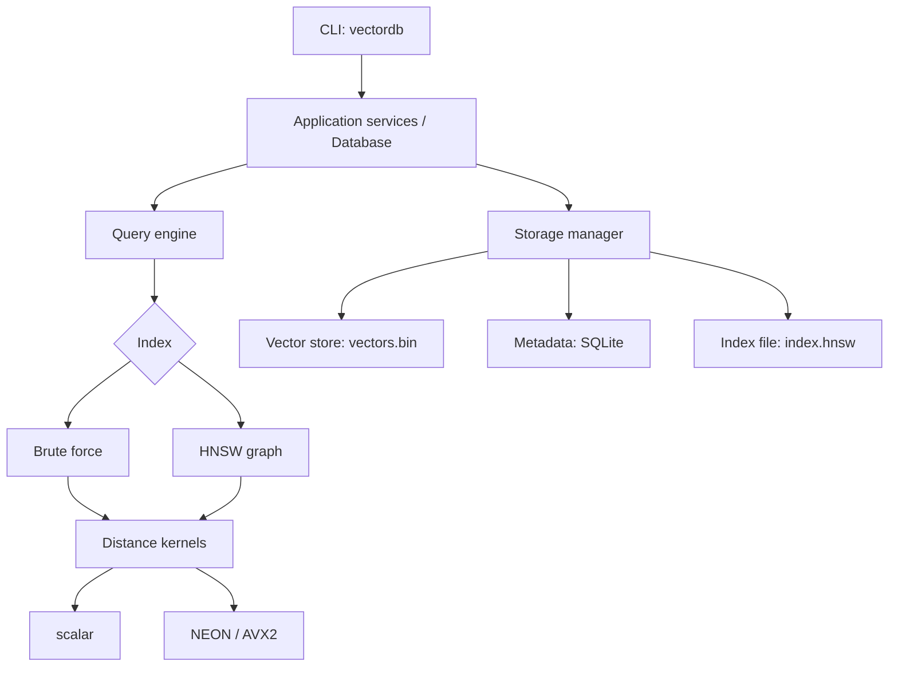

# 01 — Project Overview

🟢 Foundational

## What problem is a vector database solving?

A traditional database answers questions about **exact values**:

```sql
SELECT * FROM papers WHERE year = 2026 AND category = 'finance';
```

It cannot answer:

> "Find me the papers that *mean* roughly the same thing as this one."

Meaning is not an exact value. The standard trick is to turn each item into a
list of numbers — an **embedding** — produced by a model, such that items with
similar meaning land near each other in that space.

```
"a paper about interest rates"  ->  [0.021, -0.44, 0.13, ... ]   768 numbers
"a paper about central banks"   ->  [0.019, -0.41, 0.15, ... ]   close by
"a paper about frog anatomy"    ->  [-0.77,  0.31, 0.02, ... ]   far away
```

"Similar meaning" becomes "small distance". The question becomes purely
geometric:

> Given a query point in 768-dimensional space and 5,000,000 stored points,
> which 10 stored points are closest?

That is the **k-nearest-neighbour** problem, and a vector database is a system
built to answer it fast, on data that outlives the process, with metadata
attached.

## Why is it hard?

Naively it is not hard at all — you already know the algorithm:

```
for each stored vector v:
    d = distance(query, v)
keep the 10 smallest d
```

That is `O(N · D)`. For N = 5,000,000 and D = 768 it is ~3.8 billion
multiply-adds **per query**. On a laptop that is seconds. You need
milliseconds.

Everything difficult about this project follows from that gap:

| Problem | What it forces |
|---|---|
| `O(N·D)` is too slow | an approximate index — HNSW |
| N·D floats do not fit in cache | contiguous layout, memory locality |
| N·D floats may not fit in RAM | file-backed storage, memory mapping |
| Data must survive restart | binary formats, versioning, validation |
| The process can be killed mid-write | crash safety, atomic replacement |
| Many queries at once | concurrency and a read-mostly design |
| Each candidate needs D multiply-adds | SIMD |
| Approximate answers can be *wrong* | recall measurement against an exact oracle |

Notice that only the first row is an algorithms problem. The other seven are
systems problems. That ratio is why this project is a good teacher.

## What VectorDB is

- A **local, single-process, embedded** vector database. Think SQLite, not Postgres.
- Fixed dimension per database, `float32` vectors.
- Two index implementations behind one interface:
  - **brute force** — exact, the correctness oracle
  - **HNSW** — approximate, sub-linear, written from scratch
- Vectors in a versioned binary file; metadata in SQLite.
- A CLI (`vectordb`) that is a thin shell over library services.

## What VectorDB is deliberately not

Not because these are uninteresting, but because each would triple the surface
area and halve the depth:

- ❌ distributed / sharded / replicated
- ❌ a network or REST API, a GUI, authentication
- ❌ a wrapper over FAISS or hnswlib — **we implement the algorithms ourselves**;
     wrapping a library teaches you an API, not a system
- ❌ GPU acceleration
- ❌ quantization (PQ / IVF) — see [next-steps.md](next-steps.md)

The architecture keeps a future API layer *possible* without rewriting the
engine, which is a different thing from building it now.

## The shape of the system



One rule holds the whole thing together, and it is worth memorising:

> **Dependencies point downward only.**
> The query engine does not know the CLI exists. HNSW does not know SQLite
> exists. The distance kernels do not know what a database is.

Every time you are tempted to break that rule to save five lines, you are
trading a week of future debugging for those five lines.

## Where the honesty lives

- `docs/benchmark-results.md` — measured numbers, with the machine and build named.
- `docs/decisions/` — architecture decision records: what we chose, what we
  rejected, and what it costs us.
- [progress.md](progress.md) — what is genuinely implemented right now.

---

Next: [02-how-to-navigate-the-codebase.md](02-how-to-navigate-the-codebase.md)
