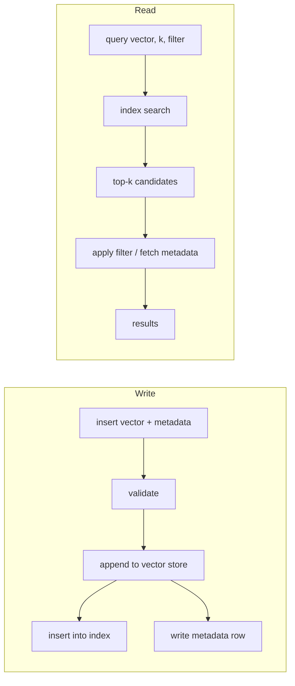

# What is a vector database?

🟢 Foundational

## From exact match to "roughly means the same thing"

A relational database answers questions about values it can compare exactly:

```sql
SELECT * FROM papers WHERE category = 'finance' AND year = 2026;
```

It cannot answer "find papers that *mean* roughly the same thing as this one",
because meaning is not a value you can index with a B-tree.

The trick that makes it possible: a model converts each item into a fixed-length
list of numbers — an **embedding** — arranged so that items with similar meaning
land near each other in that space.

```
"paper about interest rates"  ->  [ 0.021, -0.44, 0.13, ... ]   768 numbers
"paper about central banks"   ->  [ 0.019, -0.41, 0.15, ... ]   near
"paper about frog anatomy"    ->  [-0.771,  0.31, 0.02, ... ]   far
```

Now "similar meaning" is "small distance", and the database's job is purely
geometric:

> Given a query point and N stored points in D dimensions, return the k nearest.

That is **k-nearest-neighbour search**. A vector database is a system that
answers it fast, durably, at scale, with metadata attached.

## The one number that explains the whole project

Brute force is trivially correct, and you already know it:

```
for each stored vector v:
    d = distance(query, v)
keep the k smallest
```

Cost: `O(N · D)`. Put real numbers in it — N = 5,000,000, D = 768:

```
5,000,000 × 768 = 3,840,000,000 multiply-adds   per query
```

An M1 core does maybe 10–20 billion float ops/second when everything is in
cache and vectorised. But 5M × 768 × 4 bytes = **15 GB** of data, which is not
in cache and is not even in RAM on most laptops. You are bound by memory
bandwidth, not arithmetic: at ~50 GB/s you need ~300 ms just to *read* the data,
per query.

Target: **under a millisecond**.

Every hard thing in this repository exists to close that gap:

| The problem | The response | Where |
|---|---|---|
| `O(N·D)` is too slow | approximate index (HNSW) | `src/index/hnsw/` |
| data doesn't fit in cache | contiguous layout | `src/core/vector_array.*` |
| data may not fit in RAM | file-backed, memory-mapped storage | `src/storage/` |
| must survive restart | versioned binary formats | `src/persistence/` |
| process can be killed mid-write | atomic replacement, validation | ADR-0008 |
| many queries at once | read-mostly design, thread pool | `src/concurrency/` |
| D multiply-adds per candidate | SIMD kernels | `src/distance/` |
| approximate can be *wrong* | recall measured against brute force | ADR-0006 |

Exactly one of those eight rows is an algorithms problem. That ratio is the
whole reason this project teaches systems engineering rather than DSA.

## What "approximate" actually costs you

HNSW does not examine every vector, so it can miss a true nearest neighbour.
The measure is **recall@k**:

```
recall@10 = |returned top-10  ∩  true top-10| / 10
```

`recall@10 = 0.98` means that on average 9.8 of the 10 results were genuinely
in the exact top 10. For semantic search that is usually indistinguishable from
perfect — the 10th-best and 12th-best matches for "papers about interest rates"
are both papers about interest rates.

For "find this exact fingerprint", it is not acceptable at all. Which index you
want depends on your question, and the CLI lets you pick.

Recall is a dial, not a fixed property: raising `efSearch` at query time raises
recall and latency together. Measuring that curve on your own data is
[Exercise 3](../100-exercises/03-efsearch-recall-curve.md).

## The pieces a vector database needs



- **Vector store** — the authoritative copy of the floats. Everything else can
  be rebuilt from it.
- **Index** — a structure that finds candidates without scanning everything.
  Derived data, and therefore disposable.
- **Metadata store** — the non-vector attributes, and the filters over them.
- **Query engine** — turns a query plus parameters into ranked results.

The word "authoritative" carries weight. If the index file is corrupt, we
rebuild it from the vector store. If the vector store is corrupt, we have lost
data. That asymmetry drives the persistence design.

## "Why not just use Postgres with pgvector?"

You often should. `pgvector` gives you transactions, joins, backups and
operational tooling that this project does not have and will not get.

You would build your own when you want an embedded, dependency-free engine
(SQLite's niche), when you need control over the index internals, or — as here —
when the *point* is to understand what pgvector is doing under the covers.

## Where this lives in the code

Nothing yet implements search; this note is the mental model. Its concrete
sequel is [03-distance-metrics.md](03-distance-metrics.md), which is where the
first real arithmetic happens.

- `include/vectordb/core/types.hpp` — `Metric`, `IndexType`, the id model
- `include/vectordb/core/vector.hpp` — validation and normalization

---

Next: [02-vector-representations.md](02-vector-representations.md)
